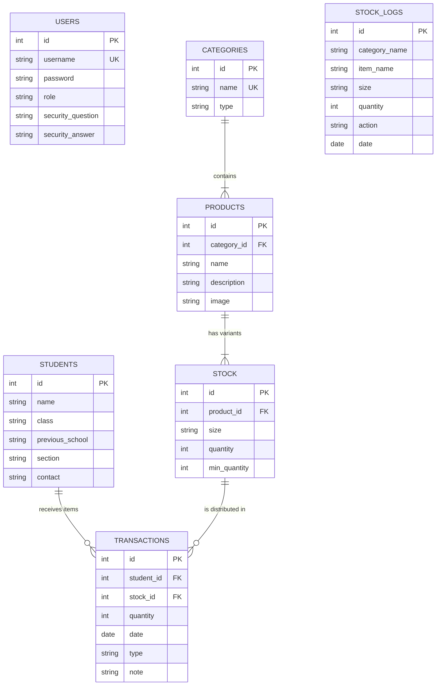

# Database Entity-Relationship (ER) Model

This document outlines the database schema for the Sunshine Inventory Management System used in the mobile application (`client_v2`).

## Schema Overview

The database is built on **SQLite** and runs locally on the Android device.

## Table Details & Key Fields

### 1. USERS
*   **Purpose:** Stores administrator credentials for secure access.
*   **Key Fields:**
    *   `id` (Primary Key): Unique ID for each user.
    *   `username`: Unique login name (e.g., 'sunshine').
    *   `password`: Securely hashed password (not plain text) for protection.

### 2. STUDENTS
*   **Purpose:** Holds the details of every child who receives items.
*   **Key Fields:**
    *   `id` (Primary Key): Unique ID for each student.
    *   `name` & `class`: Used together to identify a student.
    *   `previous_school`: Tracks history for new admissions.

### 3. CATEGORIES
*   **Purpose:** Organizes items into groups (e.g., "Uniform", "Books") to keep the inventory structured.
*   **Key Fields:**
    *   `id` (Primary Key): Unique ID for the category.
    *   `name`: The category name (e.g., 'Uniform').

### 4. PRODUCTS
*   **Purpose:** Defines *what* the item is (without size/quantity).
*   **Key Fields:**
    *   `id` (Primary Key): Unique ID for the product.
    *   `category_id` (Foreign Key): **Links to Categories table**. Ensures every product belongs to a valid group.
    *   `name`: The product name (e.g., 'Boys Shirt').

### 5. STOCK (The Real Inventory)
*   **Purpose:** Tracks *how many* of each item we have, separated by size.
*   **Key Fields:**
    *   `id` (Primary Key): Unique ID for this specific stock record.
    *   `product_id` (Foreign Key): **Links to Products table**. Tells us *which* product this stock belongs to.
    *   `size`: The specific variant (e.g., 'S', 'M', 'XL').
    *   `quantity`: The live count of available items.

### 6. TRANSACTIONS
*   **Purpose:** The central log of all distributions. Records *who* got *what* and *when*.
*   **Key Fields:**
    *   `id` (Primary Key): Unique ID for the transaction.
    *   `student_id` (Foreign Key): **Links to Students table**. Identifies the receiver.
    *   `stock_id` (Foreign Key): **Links to Stock table**. Identifies the exact item given.
    *   `date`: When it happened.

### 7. STOCK_LOGS
*   **Purpose:** A permanent audit trail. Checks history of added/removed stock.
*   **Key Fields:**
    *   `id` (Primary Key): Unique ID for the log entry.
    *   *No Foreign Keys*: Stores names as text to preserve history even if master items are deleted.

## ER Diagram Breakdown (Chen Notation)

Here is the explanation of the **Entity-Relationship Diagram** you see in the image:

### 1. Users Table
*   **Entity (Box):** `users`
*   **Attributes (Ovals):**
    *   `user_id`: Unique ID (Underlined = Primary Key).
    *   `username`, `password`, `role`: Login details.
    *   `sec_question`, `sec_answer`: Added for password recovery security.
*   **Relationships:** Independent entity for login (no direct lines to inventory).

### 2. Categories Table
*   **Entity (Box):** `categories`
*   **Attributes:** `id` (PK), `name`.
*   **Relationship (Diamond):** **Contains** (1:N)
    *   One Category *contains* Many Products.

### 3. Products Table
*   **Entity (Box):** `products`
*   **Attributes:** `id` (PK), `name`, `desc`, `cat_id` (Foreign Key link to Category).
*   **Relationship (Diamond):** **Has Variants** (1:N)
    *   One Product *has many* Stock variants (Sizes).

### 4. Inventory (Stock) Table
*   **Entity (Box):** `stock`
*   **Attributes:** `id` (PK), `size` (e.g., S/M/L), `qty` (Quantity), `prod_id` (FK link to Product).
*   **Relationship (Diamond):** **Is Distributed In** (1:N)
    *   One Stock Item *is distributed in* Many Transactions.

### 5. Students Table
*   **Entity (Box):** `students`
*   **Attributes:** `id` (PK), `name`, `class`, `prev_school`.
*   **Relationship (Diamond):** **Receives** (1:N)
    *   One Student *receives* Many key Transactions.

### 6. Transactions Table
*   **Entity (Box):** `transactions`
*   **Attributes:** `id` (PK), `date`, `qty`, `stock_id` (FK), `stud_id` (FK).
*   **Role:** The "Hub" that connects **Students** and **Stock**. It records the event of items changing hands.

## Design Decisions (Why some tables are separate?)

### 1. Why is the USERS table separated?
The **USERS** table is used purely for **Authentication** (Login access).
- In this system, the "Inventory" belongs to the **Organization**, not a specific user.
- Therefore, products and transactions are not linked to a specific `user_id`. Any admin who logs in manages the same central inventory.

### 2. Why is the STOCK_LOGS table separated?
The **STOCK_LOGS** table is designed for **Audit History**.
- It deliberately does **NOT** use Foreign Keys (like `product_id`).
- **Reason**: If you delete a Product from the system, a Foreign Key link would also delete its entire history (Cascade Delete).
- By storing the **Product Name** and **Category Name** as text, we ensure that the history remains permanently available even if the original item is deleted from the database.
